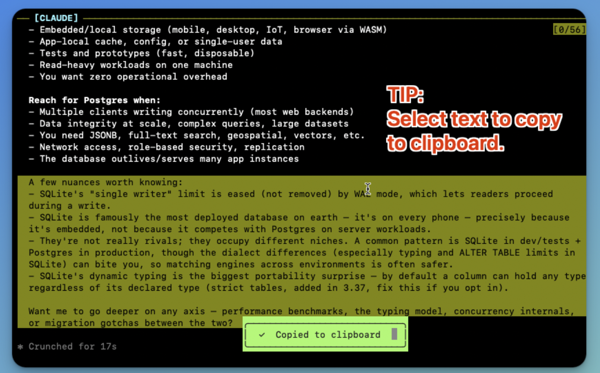
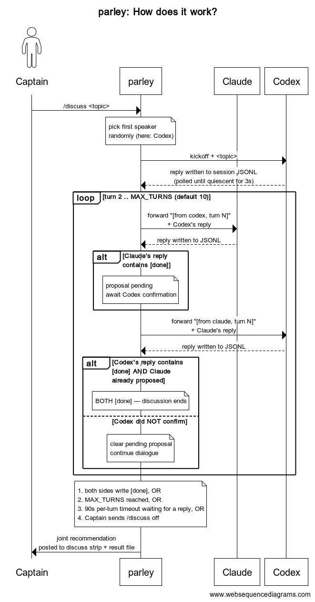

# parley

[](./LICENSE)


<p align="left">
  
</p>

> *"Two minds at a table, one recommendation."*

Run **Claude Code** and **Codex CLI** side-by-side in a single tmux workspace. Address either agent individually, or hand them a topic and let them debate until they hand you back a joint recommendation.

*Parley* (n., v.) — a negotiation between parties at variance, conducted under truce. From French *parler*, "to speak." Historically a maritime convention: rival ships' captains would raise a flag and meet to talk before firing. Here, it's what happens when you summon Claude and Codex to a structured debate and **don't let them leave the table until they agree on the answer**.

If that rings a bell — yes, it's the same *parley* invoked in *Pirates of the Caribbean*, where it's a clause in the Pirate Code: anyone who calls it has the right to safe passage and a hearing before the captain. Same idea here: when you call `/discuss`, the two agents have to come to the table and talk it out before either gets to dismiss the question.


## Requirements

- macOS or Linux
- `tmux` 3.0+
- `python3` 3.9+ with `prompt_toolkit`
- [`claude`](https://docs.claude.com/en/docs/claude-code/overview) (Claude Code) on PATH
- [`codex`](https://github.com/openai/codex) (Codex CLI) on PATH

## Install

```bash
brew tap masterjk/parley
brew install parley
parley doctor
```

`claude` and `codex` are external prerequisites; `parley doctor` checks that they are present and prints upgrade/install hints.

## Why

You already have two strong coding assistants. They each have blind spots. Triangulating their opinions on a hard call usually means alt-tabbing, copy-pasting, and translating between contexts. parley does that for you in one workspace — and adds a structured **debate protocol** so the agents converge on something useful instead of wandering.


## Demo

### &raquo; Talk to either.  Or both.

`@claude` or `@codex` targets one agent.  Plain text broadcasts to both.  Two takes, side-by-side, one workspace — no alt-tabbing, no copy-paste between terminals.


### &raquo; Or hand them a topic and walk away.

`/discuss <topic>` makes them debate it out. They go back and forth automatically, each pushing back on the other's claims, until both write `[done]` — then the joint recommendation lands in front of you. One command, then hands-off.


## Commands (inside the relay pane)

```
@claude <msg>      route to Claude only
@codex  <msg>      route to Codex only
<msg>              broadcast to both agents

/discuss <topic>   start an agent-to-agent debate
/discuss off       stop the debate and close the strip
/status            show edit owner, last route, and discussion status
/quit              kill the tmux session
```

Tab cycles autocomplete for both `@targets` and `/commands`.

## Features




## How?

<p align="left">
  
</p>

## Status

v0.1 — early access. Productization in progress: Homebrew tap setup, release checksums, and broader CLI compatibility testing.

## License

MIT — see [LICENSE](./LICENSE).
